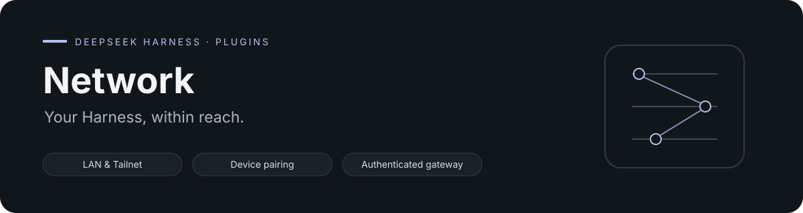

<div align="center">



# DSH Network

[English](README.md) · [简体中文](README.zh.md)

[](https://www.npmjs.com/package/dsh-network) [](LICENSE) [](https://github.com/topics/dsh-plugin)

</div>

从局域网、Tailnet 或已有的 HTTPS 入口连接 DeepSeek Harness。客户端完成配对后，同一主机可以保留多条访问路径。

## 一台主机，多种连接方式

| 路径 | 地址 | 设置方式 |
| --- | --- | --- |
| **局域网** | 可达的本地网关地址 | 选择 LAN，扫描配对二维码。 |
| **Tailnet** | Tailscale Serve MagicDNS HTTPS 地址 | 在已登录的主机上选择 Tailscale。 |
| **自定义 HTTPS** | 已运行的反向代理地址 | 创建二维码时提供该地址。 |

DSH 保持监听 loopback；插件在前面提供认证网关，使用短时配对票据、轮换的设备凭证和持久主机 ID。网关会把外部请求的 `Host` 和 `Origin` 改写为回环上游地址，继续由 DSH 自己的同源校验保护 HTTP 与 WebSocket 请求。

## 快速开始

```bash
dsh plugin --profile web add dsh-network@latest
dsh web
```

打开 **设置 → Network** 查看主机并生成配对二维码，也可以在另一个终端运行设置向导：

```bash
dsh plugin --profile web exec dsh-network setup
```

选择 **LAN**、**Tailscale** 或 **自定义地址**，再用兼容客户端扫码。未指定模式时，向导会询问，不会自行选择。

默认网关端口是 `3081`。底层 DSH Web 服务仍在其配置端口监听 loopback。

## 选择连接路径

```bash
# 局域网：两台设备需要互相可达
dsh plugin --profile web exec dsh-network setup lan

# Tailnet：需要先安装并登录 Tailscale
dsh plugin --profile web exec dsh-network setup tailscale

# 已有、可正常工作的 HTTPS 网关
dsh plugin --profile web exec dsh-network setup custom --url https://dsh.example.com
```

LAN 自动探测选错网卡时，可以用 `--url http://HOST:3081` 指定地址。Tailscale 设置会配置 Serve 转发到认证网关。公网自定义路径需要已有可信 HTTPS 和 HTTP/WebSocket 转发；本插件不配置 DNS、证书、防火墙或反向代理。

## 清晰的设置状态

Network 页面把主机身份和设备配对分开，提供字段标签、等待状态和就地错误提示，适配中英文与浅深色主题。离开设置页会取消仍在等待的请求。

配置有效的 HTTPS `iosAppDownloadURL` 后，可以显示可关闭的 App 下载卡片；未配置时不显示。

## 配置

| 字段 | 默认值 | 用途 |
| --- | --- | --- |
| `gatewayPort` | `3081` | 认证网关端口。 |
| `bindHost` | `0.0.0.0` | 网关监听接口；`127.0.0.1` 仅监听本机。 |
| `hostName` | 系统主机名 | 主机显示名称。 |
| `statePath` | `$DSH_HOME/network/state.json` | 配对与设备状态。 |
| `historyChunkTrim` | `true` | 移除历史响应中已完成步骤的冗余流式片段。 |
| `historyTrustedHosts` | `[]` | 历史路由允许的额外直连 Web Host 值。 |
| `iosAppDownloadURL` | 未设置 | 可选下载卡片的 App Store 或 TestFlight HTTPS 地址。 |

`DSH_HOME` 默认是 `~/.dsh`。历史裁剪保留已显示消息、首 token 时间和当前未完成输出，减少重复增量，具体收益取决于会话；这些路由继续执行宿主的 origin 与跨站检查。

## 配对与凭证

配对票据一次有效，五分钟后过期。配对成功后，客户端获得刷新凭证和一小时有效的访问 token，刷新时两者一起轮换。主机仅保存哈希，不保存原始凭证；配对链接按需生成，不主动广播。

局域网 HTTP 依赖可信本地网络。公网应通过 HTTPS 暴露认证网关，不要暴露底层 DSH Web 端口。详见[公网部署边界](docs/internet-compatibility.md)。

## 常见问题

| 现象 | 检查方向 |
| --- | --- |
| LAN 地址打不开 | 设备可达性、私有接口防火墙规则和选中的 IP。 |
| Tailscale 设置失败 | `tailscale status` 和已有登录状态。 |
| 公网路径失败 | 可信 TLS，以及 HTTP/WebSocket 反向代理转发。 |
| 二维码过期 | 重新生成一次性配对票据。 |

设置页的完整设备列表与撤销控制仍属后续工作；当前面板提供主机状态、已配对设备数量和配对入口。

## 开发与反馈

```bash
npm ci
npm run check
```

[提交问题](https://github.com/baixianger/dsh-network/issues) · [版本记录](RELEASES.md) · [MIT 许可证](LICENSE)
